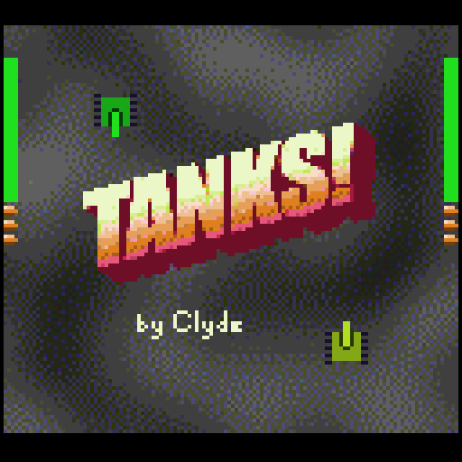
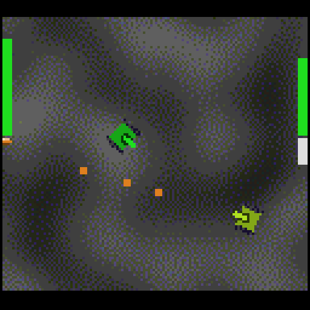

#! Tanks!

Left/right -> steer
Up -> forward
Down -> backward
A -> shoot

Build it with the "make" command

Import art/music by adding it to a folder inside the "assets" directory, and then run "make import" to update generated project files.

If you have pulled and built the GameTankEmulator repo in an adjacent folder, run "make emulate" to test the game.

src/main.c contains the code that will run after the console powers on

## Build requirements:

* cc65 https://cc65.github.io/

* NodeJS https://nodejs.org/

* Zopfli https://github.com/google/zopfli

* GNU Make

## Testing requirements:

* GameTank Emulator https://github.com/clydeshaffer/GameTankEmulator